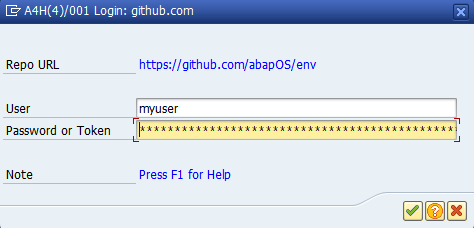

Online projects may require authentication to create branches or commits on the remote or even fetch the content in case of private repositories. Since abapGit uses git over HTTP the authentication mechanism is Basic Authentication (RFC 2617) using a combination of username and password or username and token (see below). If the remote requires authentication for an action, a popup will appear to enable the user to provide the necessary login details. Once authentication is successful the session remains intact until you exit or restart abapGit.

Note: Apparently, SAP ABAP supports only RFC 2617 for Basic Authentication and *not* RFC 7617. Therefore, you have to use ASCII characters only for your repository passwords (including extended ASCII, hex 20 to FF, https://en.wikipedia.org/wiki/ISO/IEC_8859-1). The Euro symbol, for example, is *not* included since it's Unicode U+20AC (which would require RFC 7617 and UTF-8 encoding of passwords). SAP has documented this limitation in SAP Notes [1240796](https://launchpad.support.sap.com/#/notes/1240796).

## Token or Two Factor Authentication

Most git hosts allow for two factor authentication. Relevant for abapGit is how to authenticate with 2FA enabled on the command line when using git over HTTP. This is usually done using a token instead of the normal password. Check the documentation of your git host on how to do this (see links below). Note that the username might be different from your normal one when using the token as the password.

- [GitHub](https://docs.github.com/en/github/authenticating-to-github/accessing-github-using-two-factor-authentication#using-two-factor-authentication-with-the-command-line): username / token or oauth / token
- [GitLab](https://docs.gitlab.com/ee/user/profile/personal_access_tokens.html): oauth / token
- [Bitbucket](https://support.atlassian.com/bitbucket-cloud/docs/app-passwords/): username / app password (Settings > Account settings > Username, not E-mail)
- [Azure DevOps](https://docs.microsoft.com/en-us/azure/devops/organizations/accounts/use-personal-access-tokens-to-authenticate): username / token
- [AWS CodeCommit](https://docs.aws.amazon.com/codecommit/latest/userguide/setting-up-gc.html): generated username / password

## Using a Password Manager

To store passwords or tokens you might want to use a password manager. To enable autofill you can match the window title of the entry to the following pattern:

`NPL(*)/001 Login: github.com`

Note the part `NPL(*)/001` only appears if you have `Show system name in taskbar button` enabled in the SAP GUI options:

## Using a Custom Authentication Mechanism

You can use the exit `CREATE_HTTP_CLIENT` to implement a different authentication yourself by returning an already authenticated HTTP client instance. See the [exit documentation](ref-exits.html#create_http_client) for examples.

## Security Considerations

abapGit intentionally does not provide a way to store login data across sessions. This is because SAP systems are multi-user-systems and since abapGit is mostly used by developers on shared development systems who have extensive authorizations any approach to store passwords runs the risk of getting abused. On local single user systems you can easily implement the exit mentioned above to permanently store the login data in a RFC destination. Otherwise a password manager is the recommended approach to store login data (see discussion in [#3798](https://github.com/abapGit/abapGit/issues/3798).

## Troubleshooting

Authentication issues typically lead to "Unauthorized access. Check your credentials" error (HTTP 401). Here are some areas to check:

- Git Server
  If your git server is hosted in-house (not publicly accessible), talk to your IT team to understand which connection and login details are required.
- Connection
  Check that the connection to the git server works (see [SSL Setup](guide-ssl-setup.html) and [SSL Test](guide-ssl-test.html)). If you have to use a proxy, check that the connection works and maintain the proxy in the [abapGit settings](guide-settings-global.html).
- Password or Token
  Verify which login method is required by your git server. Do you need a password or token (see above)? Check that password or token contain only ASCII characters. Special characters are not supported.
- Token Validity
  Usually, tokens have an expiry date and a reduced function scope. Check that your token is still valid and has the necessary authorizations for the abapGit features you want to use (repo read/write).
