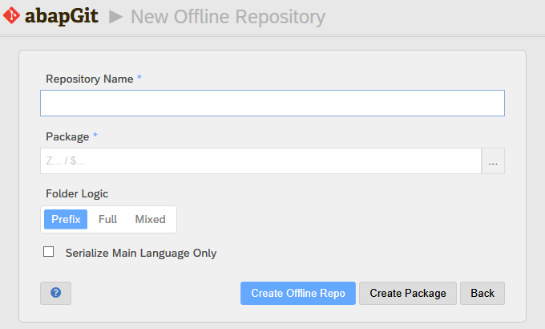
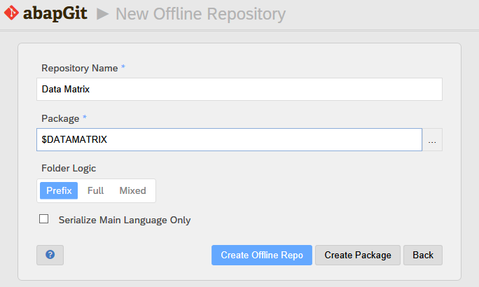

* Start ZABAPGIT

* Select "New Offline"

* Enter the name for your project along with a package name (for example, , "Datamatrix" and $DATAMATRIX). If the package does not exist yet, it will be created automatically when pulling. Alternatively, you can select "Create Package" to create the package manually with your own settings.

* **WARNING: If you select an existing package that already includes objects, you run the risk of overwriting or even deleting these object when pulling from the ZIP file.** There will be a warning popup in such case, previewing of what will happen. Beware of the choices you make.

* To be on the safe side, we recommend to always use an *empty* SAP package when installing an abapGit repository. 

* Select "Create Offline Repo"

* Now you have a new offline repository. You can add your own objects to the package or import objects via a ZIP file.
