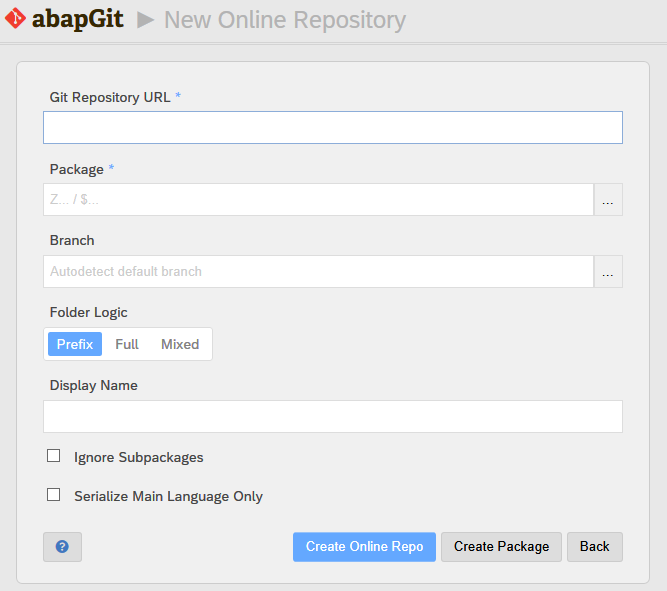
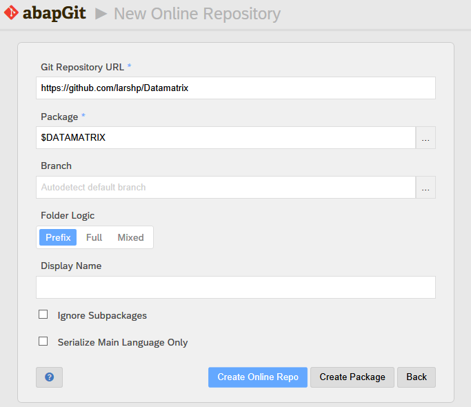

* Start ZABAPGIT

* Select "New Online"

* Enter the URL for the GitHub project along with a package name (for example, https://github.com/larshp/Datamatrix and $DATAMATRIX). If the package does not exist yet, it will be created automatically when pulling. Alternatively, you can select "Create Package" to create the package manually with your own settings.

* **WARNING: If you select an existing package that already includes objects, you run the risk of overwriting or even deleting these object when pulling from the repository.** There will be a warning popup in such case, previewing of what will happen. Beware of the choices you make.

* To be on the safe side, we recommend to always use an *empty* SAP package when installing an abapGit repository. 

* Select "Clone Online Repo"

* Select "Pull" to copy all objects from the Git repository into the SAP system

