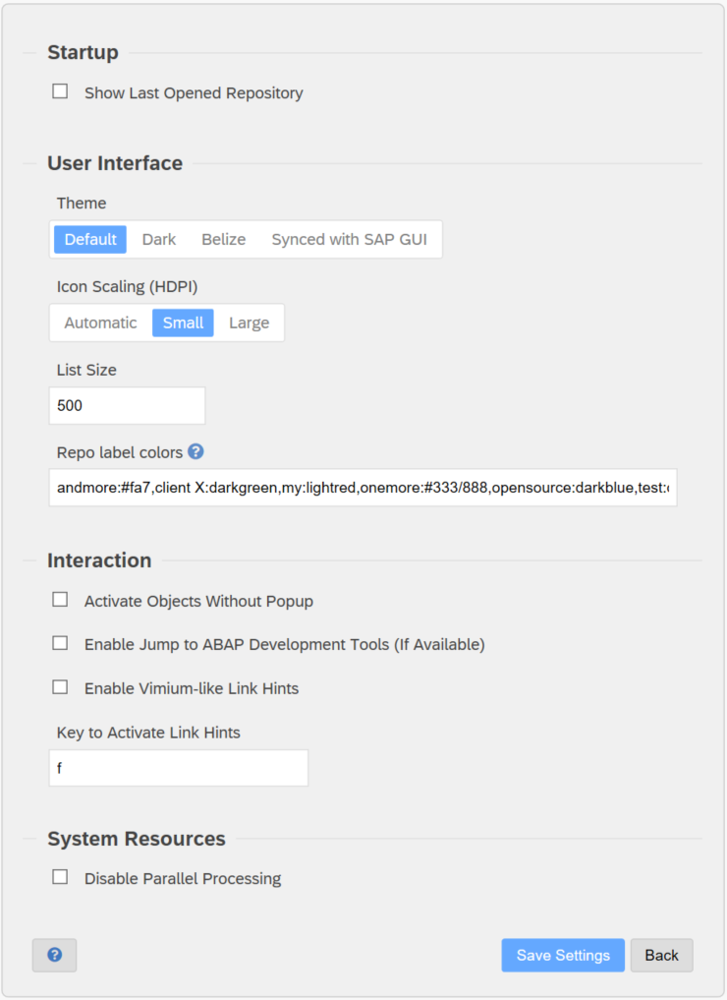

Personal settings in abapGit are valid only for the logged on user. You can maintain the
settings from the repository list or repository view by selecting "Settings > Personal".

Note: Personal settings are relevant to all of your repositories.

## Startup

If you turn on "Show Last Opened Repository", abapGit will jump directly to the repository that you worked on last.

## User Interface

You can switch the **Theme** for abapGit between several choices: Default, Dark, and Belize. Alternatively, you can select "Synced with SAP GUI" to use the same theme
you are using for SAP GUI (availability depends on SAP GUI release).

The size of icons can be changed using **Icon scaling**. The setting is intended for [High DPI displays](https://doc.qt.io/qt-5/highdpi.html).

**List Size** defines the maximum number of items shown in a list. If there are more items, then abapGit start paging.

**Repo label colors** allows you to customize colors of organization labels at repo overview page. The format of the configuration is: `"label1:color,label2:color"`. `Color` param accepts either a predefined css-style name or RGB color spec in format of `#<foreground>/<background>` e.g. `#3040ff/ff8a80`. See more (in particular, css style list) in "?" hint box.

## Interaction

Typically, when objects are changed, the system will display a popup to confirm the activation of objects. This gives the change to address syntax errors, for example.
If you want objects to be activated automatically, select **Activate Objects Without Popup**. If there are syntax errors, abapGit will indicate this with an icon next to
the objects in the repository view.

If you are using ABAP Development Tools (ADT) in Eclipse, we recommend to turn on **Enable Jump to ABAP Development Tools**. Clicking on objects names in abapGit will then
open the object in ADT (if available).

**Enable Vimium-like Link Hints** and **Key to Activate Link Hints** provide a feature similarly to the [Vimium browser](https://vimium.github.io/). After pressing the
activation key (default "t"), abapGit will uses a clever highlighting method to navigate using links.

## System Resources

### Standalone Version

The standalone version does not support any parallel processing. Objects of a repository are serialized sequentially.

### Developer Version

**Disable parallel processing**

The developer version of abapGit will try to use parallel processing to serialize objects of a repository. As a prerequisite, logon group `parallel_generators` (lower case) must be configured in transaction `RZ12`. If sufficient system resources are available, abapGit will use multiple threads to serialize objects.

You can disable parallel processing with this setting. Note: Use this setting in case you need to debug a serializer class.
