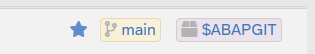
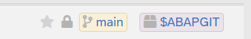
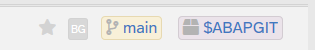
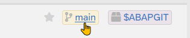
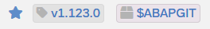
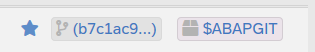

The abapGit user interface is based on HTML. Each page is structured into four sections: top, header, content, and footer.

## Page Top

At the top of each page, abapGit displays its logo and the current page title on the left, and optionally menu items on the right.

This section is "sticky" and remains at the top of the page when scrolling downwards.

## Page Header

Pages in abapGit that are related to a repository contain a header including essential repository information and some useful features.

### Icon and Description

Online Repositories:

Offline Repositories:

### Repository 

For online repositories, abapGit shows the URL, a button to change the remote settings, a button to copy the URL, the current commit, and a button to show the changelog.

### Changelog

abapGit allows to display the changelog of a repository and alert the user if a new release is available. You can read instructions on how to add a changelog to your own repository [here](https://docs.abapgit.org/development/guide-changelog.html).

### Favorite

An icon indicates if a repository is marked as a favorite. Click the icon to toggle the state.

### Write Protection

If a repository is protected against changes (in local settings), then the header will show a lock icon.

### Background Mode

For repositories that have a defined background mode (in settings), a "BG" icon will be shown.

### Branch / Tag / Commit

The currently selected remote is shown on the right of the header. This can be either a branch like "main", a tag, or a commit (hash). 

Click the name to select a different branch or tag.

### Package

The root package of the repository is shown on the far left. Click the name to jump to the package maintenance. 

## Page Content

In the area between header and footer is filled differently depending on the selected page or command. Some pages like the repository list and repository view contain an additional menu bar. Pages that contain input forms, use the top menu bar to switch between forms (like tabs) and a row of buttons at the bottom to select commands.

## Page Footer

At the end of each page, abapGit displays a footer.

### Sponsor Us

On the left, you find a link to the [Sponsor Us](https://abapgit.org/sponsor.html) page. abapGit is exclusively developed and maintained by volunteers. Any donations are highly appreciated.

### Version

In the middle under the abapGit logo, you see the current version of abapGit. This includes version number and a description whether you can running the [standalone](guide-install.html#install-standalone-version) or the [developer version](guide-install.html#install-developer-version).

Hovering of the logo shows the backend runtime of the last navigation step. Clicking the logo takes you to the [abapGit Homepage](https://abapgit.org/).

### JavaScript

On the right, a small texts shows the state of any JavaScript that may be included on the page. In general, this should show "js: OK". In case of issues, the text might show debugging information or no text at all. For details, see [here](https://docs.abapgit.org/development/developing-ui-js.html).
