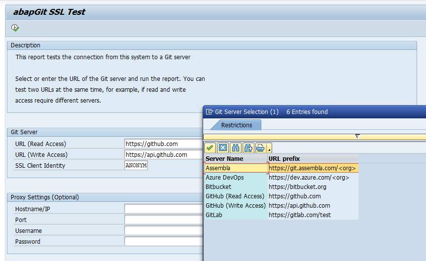

The report [zabapgit_test_ssl](https://raw.githubusercontent.com/abapGit/docs.abapgit.org/main/src/zabapgit_test_ssl.abap) can be used to test SSL connection to github. Copy paste the report into the ABAP system use package `$TMP`

### Selection Screen

### Expected Result

### Errors and Troubleshooting

If the connection does not work, the output will show an error message. You can click the message to see the detailed response to the HTTP request.

Please see [SSL Setup](guide-ssl-setup.html) for details about the correct setup and troubleshooting tips.
